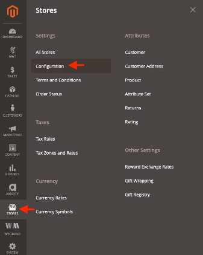
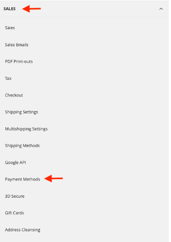
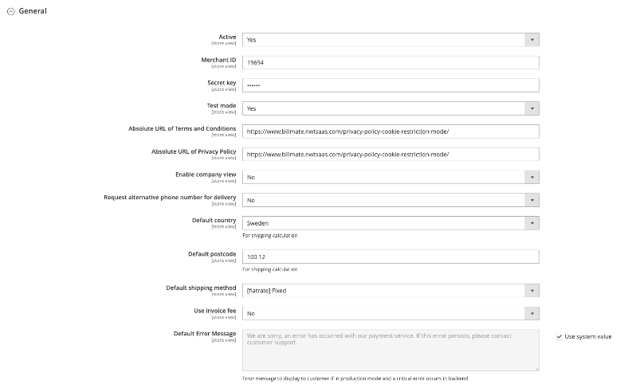
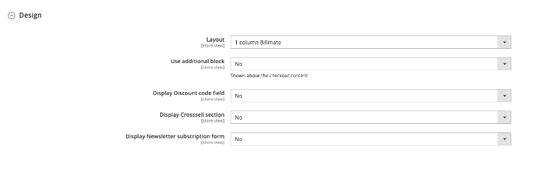

# Magento 2 installation guide for Billmate
## Requirements
* Magento version 2.3 or higher
* PHP 7.4 or higher
* If installing with Composer, Composer 2 is recommended

## Composer download
1. composer config repositories.billmate-checkout-m2 vcs git@github.com:Billmate/magento-2.git
2. composer require billmate/magento2-nwt-billmatecheckout 

## Step 2. Finding the settings in Magento admin panel.
* Go to stores > configuration

* Go to sales > payment methods

* Expand the 'Billmate checkout by Nordic Web Team' section

## Step 3. Understanding the General settings.
* Active: Yes/No to activate the checkout
* Merchand ID: A identifier which is needed to activate the checkout (provided by Billmate)
* Secret ID: Needed to activate checkout (provided by Billmate)
* Test mode: To test the checkout without using real funds.
* Absolute URL of Term and Conditions: Link your terms & conditions page in checkout
* Absolute URL of Privacy Policy: Link your privacy policy in checkout
* Begin in company view: Yes/no switch to choose wether B2B is default or not.
* Request alternative phone number for delivery: Lets customer have alternative phone number.
* Default country: For shipping calculation
* Default postcode: For shipping calculation
* Default shipping method: Lets you choose the which shipping method is default
* Use invoice fee: Lets you have a invoice fee. (Needs to be setup on Billmate side)
* Default error message: Error message to display if in production mode and a critical error occurs in backend.

## Step 4. Understanding the Design settings.
* Layout: There are 2 different layouts on the checkout
* Use additional block: Yes/No to add a block (content) above the checkout.
	*  Additional block: When 'Use additional block' is 'Yes', choose the block here.
* Display Discount code field: Yes/No if you wanna use magento discount function
* Display Cross sell section: Yes/No if you wanna use magento Cross sell function
* Display Newsletter subscription form: Yes/No if you wanna use the magento newsletter signup function.

## Step 5. Understanding the Development settings.
* Callback domain for testing: Alternative domain for callbacks from Billmate. For use in non-public testing environments. Do not use in production.